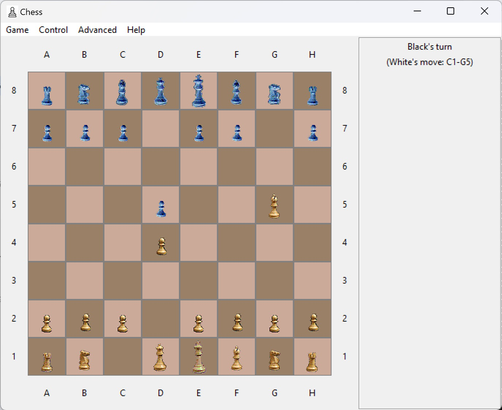
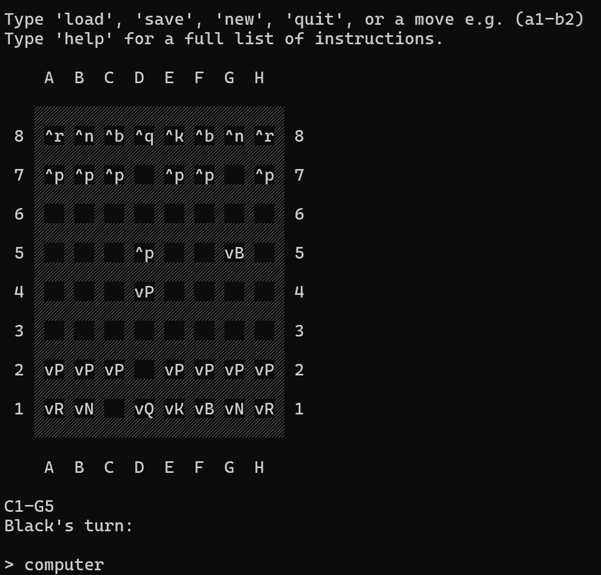

chess_python
============

**2014:** 

An attempt at a chess game - I'm doing this in parallel projects in Python and C++, although this version has got a little ahead of the C++ original. Please forgive the naivety of my beginner's Python. The GUI is presented using tkinter.

Pieces are simply bitmaps - if any bitmaps aren't all available, the pieces are presented as characters. To run in console mode, just set the variable GUI to False.

Note that the computer can be played against itself, or the computer can be asked to play a move at any point - it proves quite useful to me in testing! Note the AI uses no transposition table at the moment.

**Update 1st October 2024:**

Surprisingly, this still runs. Needed to fix a couple of obvious problems that came up though, presumanly due to a later version of python. There is also an occasional assertion in the routine to evaluate whether a player is in check.

## GUI view
Best for... well, humans...
 - use ``GUI = True``:

**Tip** - unlike the C++ / Qt version, you can't drag pieces - you have to click on a piece to move (it is highlighted with a red border), and then on a destination position.

From memory, I think if you want to run the computer against itself for a full game, you need to do it in the console (which also gives you the complete history of the game), because of synchronisation issues when there is no human to interact with the UI.

## Console view
Best for game analysis and running the computer against itself.
- use ``GUI = False``:

